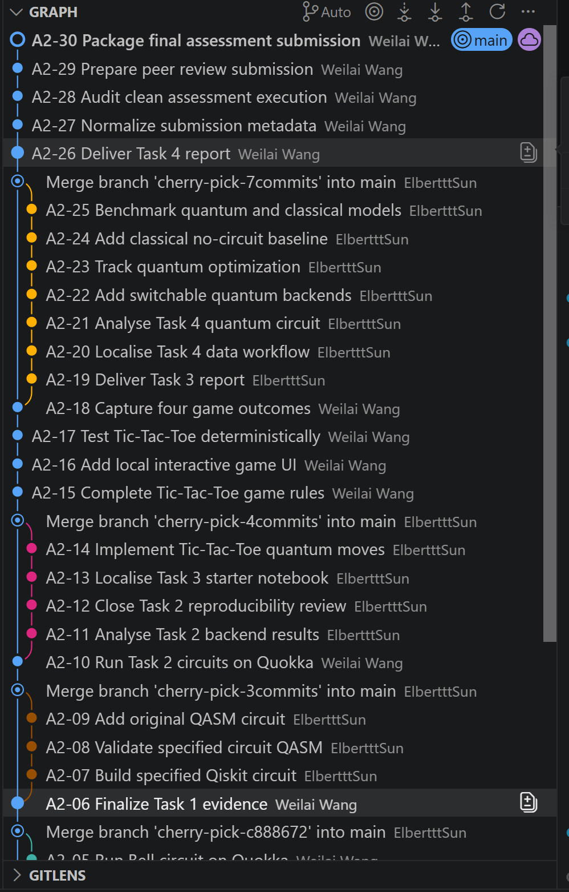
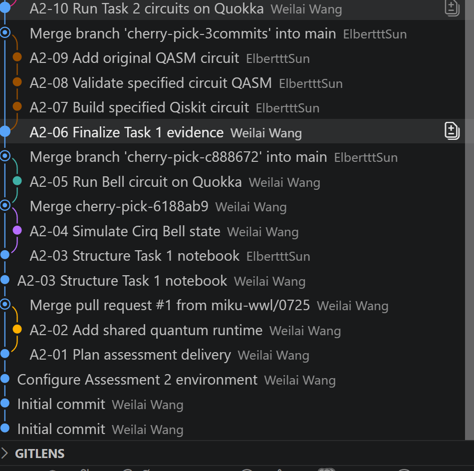

# MSE802 Assessment 2 — Team Contribution

## Team members

- **Weilai Wang**
- **Xiaotong Sun**

## Collaboration statement

This submission is one shared team deliverable. Both team members participated
in each of the four assessment tasks. We used the shared GitHub repository for
version control, integration, review, and reproducibility:

<https://github.com/miku-wwl/802-Quantum-Computing>

Neither member worked on only a separate subset of tasks. The task work was
developed collaboratively, with changes reviewed and integrated through the
shared repository.

## Contribution record

| Area | Weilai Wang | Xiaotong Sun |
|---|---|---|
| Task 1 — Entanglement | Co-developed the Cirq Bell-state circuit, local simulation, Quokka evidence, notebook explanation, and result interpretation. | Co-developed and reviewed the circuit explanation, simulation/evidence presentation, result interpretation, and notebook quality. |
| Task 2 — Qiskit circuits | Co-developed the specified and original Qiskit/OpenQASM circuits, backend runs, figures, and analysis. | Co-developed and reviewed circuit construction, QASM validity, measurement interpretation, figures, and analysis. |
| Task 3 — Quantum Tic-Tac-Toe | Co-developed game rules, quantum gate operations, circuit generation, interactive flow, test evidence, and report content. | Co-developed and reviewed gameplay, gate behavior, replay/evidence coverage, notebook presentation, and report content. |
| Task 4 — Quantum ML | Co-developed the quantum/classical implementations, backend validation, optimization evidence, comparisons, and report content. | Co-developed and reviewed the input encoding, model explanation, benchmark interpretation, plots, and report content. |
| Final integration | Maintained the shared repository, integrated the final submission, ran automated checks, and prepared the ZIP package. | Participated in cross-review, checked task coverage and presentation, and reviewed the final submission package. |

Both members reviewed the final notebooks, reports, evidence files, README,
citations, and submission package before submission.

## Repository evidence

The shared repository history provides an additional record of collaboration.
The Git Graph screenshots show commits authored under both team members'
accounts, as well as the integration merges into `main`:

- **Weilai Wang**: environment setup and planning, Task 1 evidence, Task 2
  Quokka execution, Task 3 gameplay/evidence work, and final packaging.
- **Xiaotong Sun (ElbertttSun)**: Task 1 notebook development, Task 2 circuit
  and backend analysis, Task 3 starter/game implementation, Task 3 report,
  and Task 4 workflow, circuit, optimization, baseline, and benchmark work.
- The merge commits document the integration of both members' work into the
  shared `main` branch.

The screenshots are supporting evidence of the commit history; the repository
itself is the authoritative record:

<https://github.com/miku-wwl/802-Quantum-Computing>

### Git Graph screenshots

